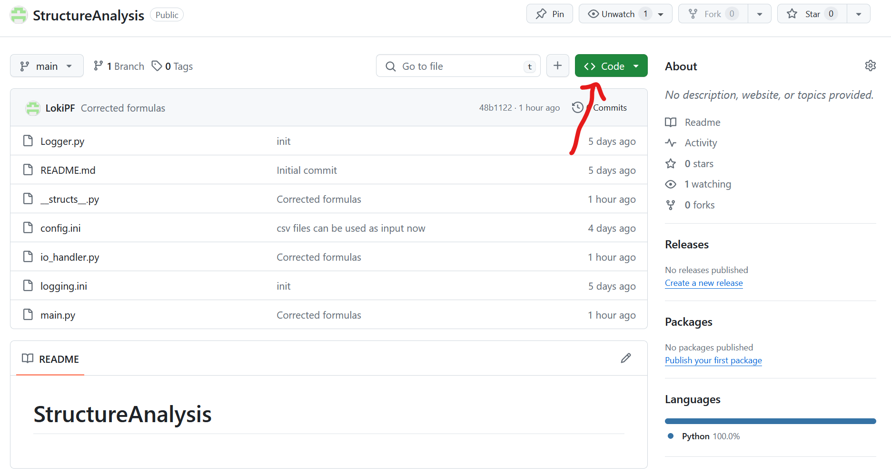
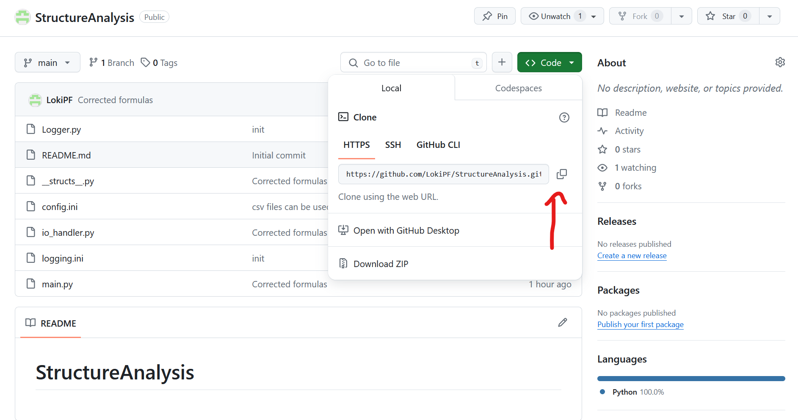
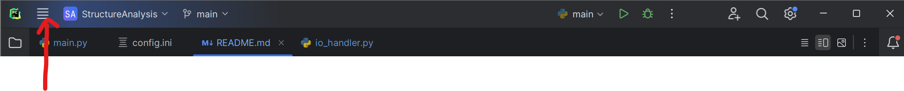
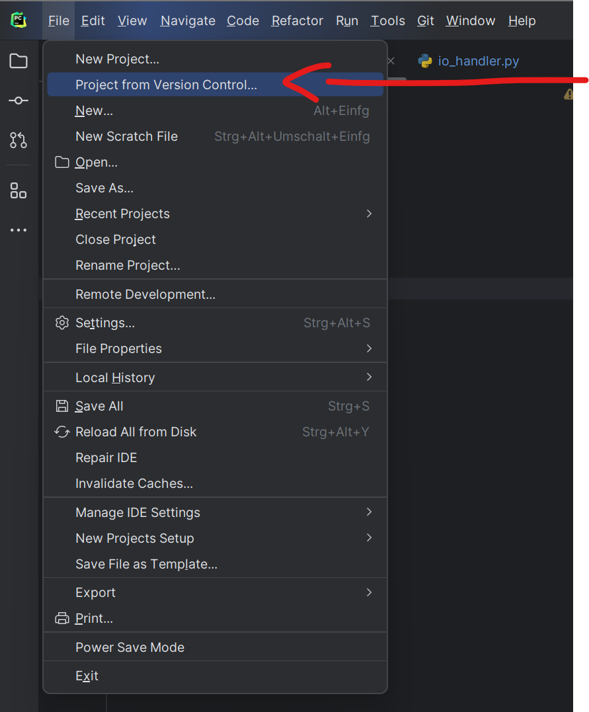
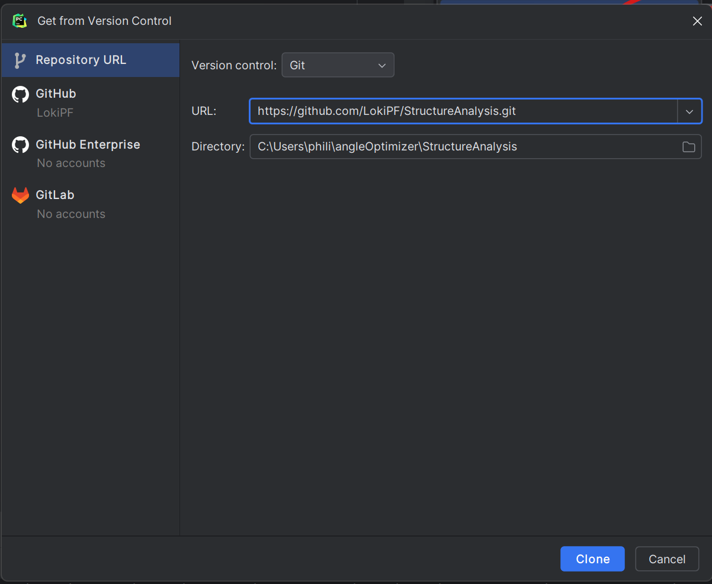
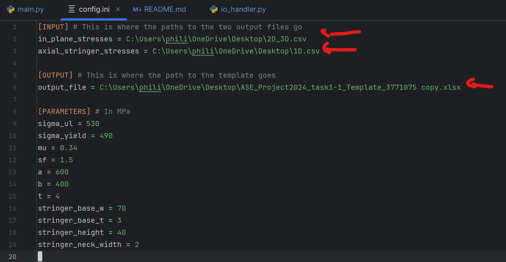

# StructureAnalysis

**Use Code at own risk**

## Install via GitHub
1. Go to "Code" \
   
2. Copy url \
   
3. Open PyCharm and navigate to top left \
   
4. Project from Version Control \
   
5. Post url and clone \
   

## Edit config.ini
Adapt the input and output files. \
**The input must be .csv and the output .xlsx** \
